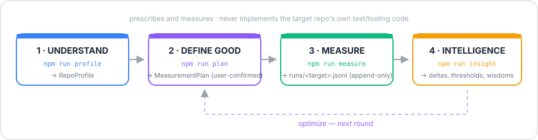

<div align="center">

# repo-intelligence

**Architect & benchmark intelligence for any repo or harness.**

Understand a repo, prescribe its tooling, define the metrics it must track, capture measurements
into a permanent time series, and derive insights — including comparisons between AI models and
workflow variants ("wisdoms").

This is a **meta-layer**: it decides and measures — it never implements the target's own test or
tooling code.

[](LICENSE)
[](https://www.typescriptlang.org)
[](package.json)
[](package.json)
[](https://github.com/0xtrou/repo-intelligence/actions/workflows/ci.yml)
[](https://www.conventionalcommits.org)
[](https://github.com/0xtrou/repo-intelligence/commits/main)



</div>

---

Read [PHILOSOPHY.md](PHILOSOPHY.md) first — it is the constitution. Metric vocabulary lives in
[METRICS.md](METRICS.md) (canonical, additive-only).

## The four-layer model

| # | Layer | Business analogy | Question it answers | Artifact | Command |
|---|---|---|---|---|---|
| 1 | **Understand** | business model canvas | "What is this repo — inside, boundary, outside?" | `RepoProfile` | `npm run profile -- <target>` |
| 2 | **Define good** | strategy & KPIs | "Which tools, which metrics A/B/C/E, which thresholds?" | `MeasurementPlan` | `npm run plan -- <profile.json>` |
| 3 | **Measure** | business metrics | "Where are we today?" | `RunRecord`s (append-only time series) | `npm run measure -- <target> <record.json>` |
| 4 | **Intelligence** | BI & decisions | "What do we do next? Which wisdom wins?" | insight report | `npm run insight -- <target>` |

Layer 2 output is always a **draft until the user confirms** — the architect advises, the human decides.
The **Inside–Outside model** (see [PHILOSOPHY.md](PHILOSOPHY.md)) makes the market-facing dimension
un-skippable: INSIDE is scanned, BOUNDARY is declared and prescribed as `external.*`, OUTSIDE is
world-reported as `perception.*` — the meta names the zones, the meta does not go exploring.

## Quickstart

```bash
npm install

# 1. Profile any repo (works on this repo itself — self-application)
npm run profile -- . --json

# 2. Draft a measurement plan from a profile (architect step; ALWAYS user-confirms)
npm run profile -- /path/to/some/repo --out /tmp/profile.json
npm run plan -- /tmp/profile.json            # writes plans/<target>.plan.json (status: draft)

# 3. Record a measurement (validates, stamps capturedAt, appends — never overwrites)
npm run measure -- my-target /tmp/record.json --tool lighthouse --wisdom glm --fixtures base-v1

# 4. Derive insight (stats vs baseline, threshold checks, per-wisdom comparison)
npm run insight -- my-target
```

## Layout

```
PHILOSOPHY.md    the constitution — 4-layer model, principles, boundary rule
METRICS.md       canonical metric taxonomy v0 + extension rules
schema/          JSON Schemas for RunRecord and MeasurementPlan
src/
  profile.ts     Layer 1 — scan any repo → RepoProfile
  plan.ts        Layer 2 — architect: profile → MeasurementPlan draft (tooling + metrics)
  measure.ts     Layer 3 — validate + append RunRecord (append-only)
  insight.ts     Layer 4 — aggregate history → insight report
  lib/           shared types, JSONL store, CLI parser (unit-tested)
runs/            append-only measurement history (committed — history is the point)
plans/           MeasurementPlans, one file per target (confirmed plans are versioned by git)
```

## Applying it to a harness

1. `profile` the harness's repo. 2. `plan` and confirm the prescription with the team ("needs
Maestro for e2e, tracks LCP/CLS/gate-pass-rate…"). 3. Feed records into `measure` — from the
harness's existing gates, from external tools, or manually. 4. `insight` after every round.
Nothing in the harness repo needs to change to start; making it change is the *prescription's*
job, done by the harness's own agents/humans.

Compared wisdoms must share `fixtures` and differ in exactly one variable (principle 9).

## Commit convention

[Conventional Commits](https://www.conventionalcommits.org) are **enforced**: `commitlint` runs on
every commit message via a husky `commit-msg` hook, and every commit must pass the pre-commit gate.

```
feat: add a measurable capability        fix: repair incorrect behavior
docs: documentation only                 refactor: restructure, no behavior change
test: add/adjust tests                   chore: tooling, deps, metadata
build · ci · style · perf · revert
```

Scope is optional: `feat(insight): compare wisdoms on numeric metrics`.

## Development

```bash
npm run typecheck   # tsc --noEmit, strict
npm test            # node:test unit suite (runs via ts-node, ~1s)
```

- Tests use Node's built-in `node:test` runner — zero additional test dependencies.
- The **pre-commit hook** runs `typecheck` + `test` on every commit; CI (Node 22 & 25) runs the
  same gates plus a self-application check (`profile` must always work on this repo).
- Tests sandbox storage writes via the `RI_DATA_DIR` env var — real `runs/` history is never
  touched by the suite.

## Related

- The companion ZCode skill (`~/.agents/skills/repo-intelligence/`) runs this loop automatically
  in agent sessions.

## License

[MIT](LICENSE) © 2026 0xtrou
